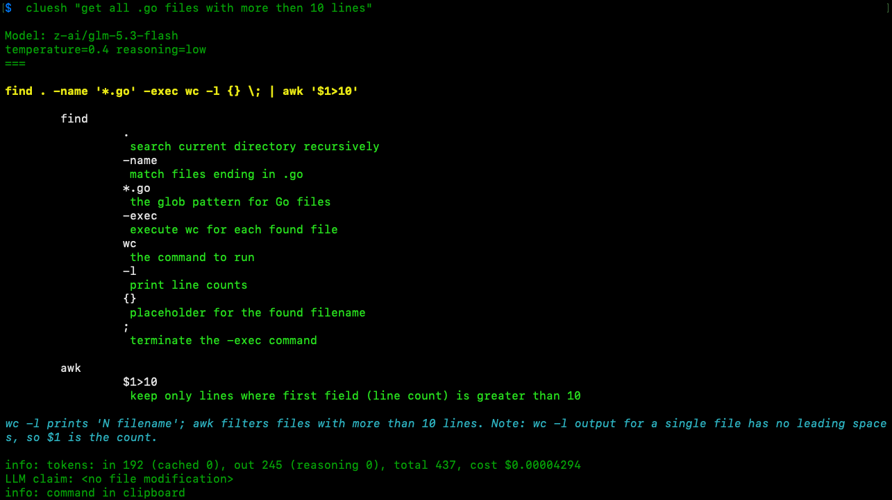

# cluesh

Natural-language demand in, one copy-paste-ready bash command out —
explained flag by flag, every time.

in:  natural-language ask for a bash command
out: one copy-paste-ready bash command, plus a structured explanation
     of every subcommand, flag and argument



<details>
<summary>Full output as text</summary>

```
$ cluesh "list all .go files with more than 10 lines" --llm oai-luna

Model: gpt-5.6-luna
reasoning=low
====

find . -type f -name '*.go' -exec awk 'FNR > 10 {print FILENAME; nextfile}' {} +

	find
		 .
		  Search from the current directory
		 -type
		  Restrict matches to files of a specified type
		 f
		  Match regular files
		 -name
		  Match filenames by pattern
		 *.go
		  Match Go source files
		 -exec
		  Run a command on the matched files
		 awk 'FNR > 10 {print FILENAME; nextfile}'
		  Print each Go filename once it has more than 10 lines
		 {}
		  Placeholder for matched filenames
		 +
		  Pass multiple matched files to each awk invocation

Lists .go files containing more than 10 lines, including filenames with spaces.

info: tokens: in 341 (cached 0), out 455 (reasoning 240), total 796
LLM claim: <no file modification>
info: command in clipboard

```

</details>

You don't need a 200-flag generalist agent to run one command. `cluesh` sends
your demand to a cheap LLM (OpenRouter, OpenAI or a local LM Studio endpoint)
and prints a colored explanation of every subcommand and flag of the resulting
command, plus the final one-liner — ready to paste. It never executes anything
itself; the only side effect is your clipboard.

Providers and models are plain JSON under `~/.cluesh/providers/` — add whatever
you need, switch with `--llm <tag>` per run.

cluesh is part of the **#agent-of-rellm** family: small agents that do one job
well. LLM communication runs on [rellm](https://github.com/dbedla/rellm) — a
lightweight Go framework for building specialized agents on the OpenAI
Responses API (LM Studio, OpenAI, OpenRouter).

Source: <https://github.com/dbedla/cluesh>

## Install

```
go install github.com/dbedla/cluesh/cmd/cluesh@latest
```

## First run

The first run creates the configuration under `~/.cluesh/`:

```
config.json          main settings (default model, clipboard mode, colors, timeout)
sysprompt.md         system prompt
providers/           one JSON file per provider (openrouter.json, openai.json, lmstudio.json)
conversation.jsonl   persisted conversation (created on the first ask)
```

Every missing file is generated with default settings and reported:
`created /home/you/.cluesh/config.json`. Existing files are never overwritten.

Mess up a config file? Remove or rename it and run `cluesh` again — the file is
regenerated with defaults.


## Setup

Only step required: give the default provider (`openrouter.json`) an API key.
Either export an environment variable (recommended):

```
export OPENROUTER_API_KEY="sk-or-..."
```

or put the key inline in `providers/openrouter.json`:

```json
{
  "api_key": "sk-or-...",
  "models": [
    {
      "tag": "or-glm53flash",
      "name": "z-ai/glm-5.3-flash",
      "temperature": 0.4,
      "reasoning": "low"
    }
  ]
}
```

`temperature` and `reasoning` (`none`|`low`|`medium`|`high`) are optional per
model; unset fields are not sent at all, since some models and providers reject
them (e.g. OpenAI reasoning models reject `temperature` for model `gpt-5.6-luna`).

If both are configured, the environment variable wins; the inline `api_key`
is used only when the env var is empty.

Each model gets a short `tag`; `default_model_tag` in `config.json` selects the
one used when no flag overrides it. Add more models per provider file
(`openai.json`, `lmstudio.json` — local models need no key).

Main settings in `config.json`:

| field                     | values / meaning                              | default |
|---------------------------|-----------------------------------------------|---------|
| `default_model_tag`       | model tag used when `--llm` is not given      | `or-glm53flash` |
| `put_cmd_in_clipboard`    | `always` \| `never` \| `read-only`            | `always` |
| `colors`                  | `dark` \| `light` \| `none` (`NO_COLOR` wins) | `dark` |
| `execution_timeout_minutes` | agent timeout per run.                      | `5` |

## Usage

```
cluesh [-c] [--llm <tag>] "<demand>"
```

Examples:

```
cluesh "list all png files larger than 1MB"
cluesh -c "now only the ones modified this week"      continue last conversation
cluesh --llm lms-gemma "count lines in *.go"          use a specific model this run
cluesh --llm-list                                     show all configured models
cluesh --help
```

## Full help

```
cluesh — natural-language demand in, one copy-paste-ready bash command out
usage: cluesh [-c] [--llm <tag>] "<demand>"

Flags:
  -c, --continue     continue last conversation
  -h, --help         show help and exit
      --llm string   use model with tag <tag> this run (default_model_tag if unset)
      --llm-list     list configured models and exit

https://github.com/dbedla/cluesh — #agent-of-rellm
https://github.com/dbedla/rellm — LLM communication framework
Detailed info: README.md

Config location: ~/.cluesh
  config.json         main settings (default model, clipboard mode, colors, timeout)
  sysprompt.md        system prompt
  providers/          one JSON file per provider (openrouter.json, openai.json, lmstudio.json)
  conversation.jsonl  persisted conversation (created on first ask)

API key setup (per provider file, e.g. providers/openrouter.json):
  "api_key_env": "OPENROUTER_API_KEY"   key from environment (recommended)
  "api_key": "sk-..."                   inline in the provider file (last resort)
  both set? the environment variable wins
```

## Models list

`cluesh --llm-list` groups every configured model by provider file; the model
matching `default_model_tag` is marked:

```
openrouter.json
	or-glm53flash	z-ai/glm-5.3-flash	(default)
openai.json
	oai-luna	gpt-5.6-luna
lmstudio.json
	lms-gemma	google/gemma-4-26b-a4b
```

## Conversation

Without flags every run starts from a fresh conversation. With `-c` the
previous conversation (from `~/.cluesh/conversation.jsonl`) is loaded and
extended, so you can iterate:

```
cluesh "list files modified this week"
cluesh -c "sort that by size"
```

## Output & clipboard

The command explanation is printed to the console (ANSI colors, `dark`/`light`/`none`
via `colors` in `config.json`, `NO_COLOR` respected). The final command is copied to the
clipboard by shell-out (`wl-copy`/`xclip` on Linux, `pbcopy` on macOS, `clip.exe` on
Windows) — install one of them, or set `put_cmd_in_clipboard`:

| value        | behavior                                              |
|--------------|-------------------------------------------------------|
| `always`     | copy every final command (default)                    |
| `read-only`  | copy only commands that do not modify any file        |
| `never`      | never copy                                            |

cluesh never executes commands itself.
